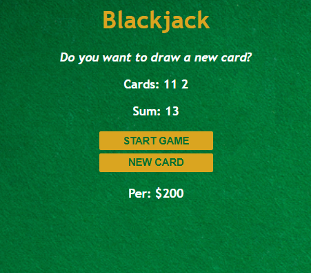

---

# 🃏 Blackjack Game

A simple **Blackjack Card Game** built with **HTML, CSS, and JavaScript**.
Play the classic casino game in your browser with a clean UI and basic game logic!

---

## 🌐 Live Demo

👉 **[Play on Netlify](https://blackjaack-game-with-js.netlify.app/)**

---

## 📸 Preview

<p align="center">
  
</p>  

---

## ✨ Features

* 🎴 **Deal Cards** – Start a new round with shuffled cards
* ➕ **Hit Button** – Draw another card to increase your score
* ✋ **Stand Button** – End your turn and let the dealer play
* 🏆 **Win/Lose Messages** – Game outcome displayed dynamically
* 📱 **Responsive Design** – Works smoothly on desktop & mobile

---

## 🛠️ Tech Stack

* **HTML5** – Structure
* **CSS3** – Styling & layout
* **JavaScript (ES6)** – Game logic

---

## 🚀 Getting Started

### 1. Clone the Repository

```bash
git clone https://github.com/srcastt/blackjack-game.git
```

### 2. Run Locally

Simply open `index.html` in your browser.

---

## 🎨 Customization

* Update styles in `style.css`
* Adjust card logic or add more features in `script.js`
* Replace placeholder images/icons with real card graphics

---

## 📜 License

This project is licensed under the **MIT License** — free to use and modify.

---

## 👤 Author

Made with ❤️ by **[srcastt](https://github.com/srcastt)**

---

